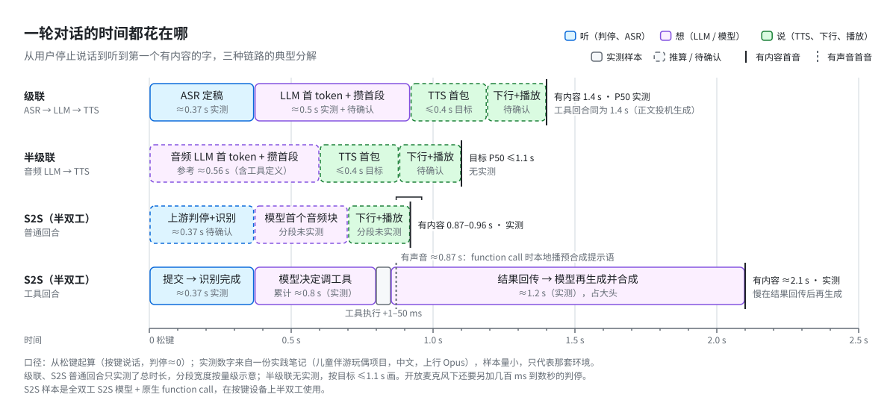
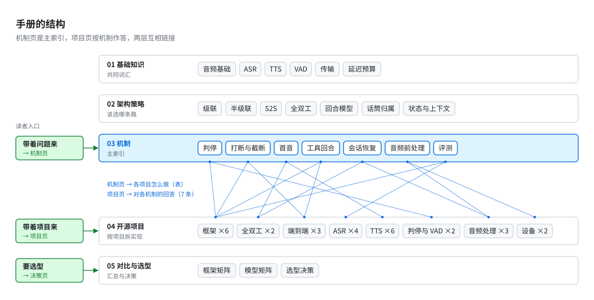
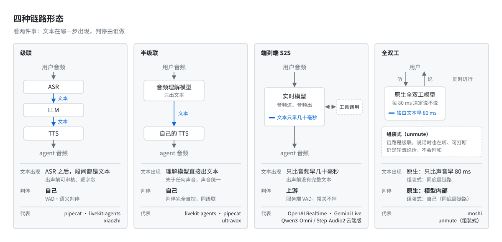
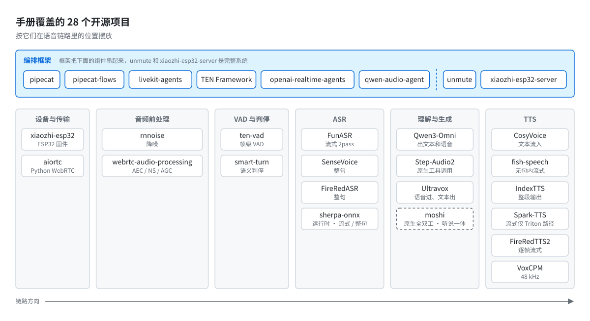

# Voice Agent Handbook

实时语音 agent 的架构手册。内容分两部分：一是链路形态（级联、半级联、端到端 S2S、全双工）的取舍，以及判停、打断、首音、工具回合、会话恢复等关键机制的设计空间；二是 28 个开源项目在这些机制上的具体实现，分析到文件和函数，并标注所依据的 commit。

面向需要搭建或改造语音 agent 的工程师。各层之间以交叉链接组织，可以按问题、按项目或按选型需求选择入口。

## 起因

2026 年我做了一个儿童硬件上的语音 agent，按键说话。上线之后有三个问题一直没有想清楚，各写成了[一篇长文](02-architectures/essays/)；为了验证文中的推断，又把能找到的开源实现读了一遍。手册由此整理而成。

第一个问题是级联的首音。判停、ASR、LLM、TTS、下行五段串行，直觉上首音取决于三个模型的速度。我把一个朴素实现逐段算了一遍：三个模型的首包合计约 1 s，实际首音却有 3.6 s。多出来的两秒多全部是等待，等静音超时，等整句转写，等 TTS 合成完整句，等建连，等设备攒满播放缓冲。优化手段只有三类：让后一段提前开始，压短某一段，把某一段移出关键路径。按这个账算，不换模型首音可以到 1.1 到 1.4 s。这是推算，我还没有跑过。原文见 [级联架构的首音优化](02-architectures/essays/cascade-first-audio-optimization.md)，手册里的展开在 [cascade](02-architectures/cascade.md) 和 [first-audio](03-mechanisms/first-audio.md)。

第二个问题是半级联能否同时满足速度、智力和自然度。可以，但平衡发生在另一层。没有一个模型三项都占优：S2S 普通回合最快、最自然，但出声前没有文本可审，工具回合最慢；文本路径可审核、工具回合快，多一段 TTS 延迟。平衡点在"这一回合走哪条路"的决定上，寒暄走 S2S，事实、方案、工具走文本路径。这件事成立有四个前提：声音统一，上下文只有一份，路由由规则决定，上游能力位事先探明。缺一不可。原文见 [半级联与混合架构](02-architectures/essays/half-cascade-hybrid-architecture.md)，展开在 [half-cascade](02-architectures/half-cascade.md) 和 [state-and-context](02-architectures/state-and-context.md)。

第三个问题是 S2S 的智力不足怎么办。它确实弱于同代文本模型，但要分开看弱在哪里。63 句冻结盲测里选工具，S2S 原生 function call 准确率 81%，小文本模型 84%，这类窄任务上差距很小。差距大的是多步推理、长上下文，以及不编造未提供的事实。我读到的四个成熟实现方向一致：S2S 负责在场和语气，智力放在规则、工具层、后台文本模型和自己的数据里。代价是每外置一项就多一次工具回合，而 S2S 的工具回合比普通回合慢约 1.2 s。所以外置必须和"收口不再生成、结果本地播报"一起做，否则每外置一项就多付 1.2 s。原文见 [S2S 架构下的智力外置](02-architectures/essays/s2s-intelligence-externalization.md)，展开在 [s2s](02-architectures/s2s.md) 和 [tool-calls](03-mechanisms/tool-calls.md)。

三个问题的答案都落在时间上。文本 agent 可以先想清楚再回答，语音 agent 在用户停止说话后一秒多就必须出声，否则用户会认为设备失灵。这个约束决定了架构的大部分形状，ASR 和 TTS 只是其中的组件。

<picture>
  <source media="(prefers-color-scheme: dark)" srcset="assets/latency-timeline-dark.svg">
  
</picture>

图中实线框为实测，虚线框为推算或目标值。数字的口径见后文。

## 怎么读

手册分五层，通常从三个入口进入。

带着具体问题来，比如判停有几种做法、被打断后上下文怎么截断、工具回合为什么慢，从 [03-mechanisms](03-mechanisms/) 进入。每个机制页末尾有一张表，列出 28 个项目各自的做法和代码路径。

带着某个项目来，比如想知道 pipecat 的打断如何在管道里传播，或者 livekit 的 RealtimeModel 如何与本地上下文同步，从 [04-projects](04-projects/) 进入。项目页使用同一个模板，其中一节逐条回答七个机制。

要选型，从 [decision-guide](05-comparison/decision-guide.md) 进入。先回答八个问题，然后是一棵决策树和六个场景的配方，每个配方附已知的坑。

<picture>
  <source media="(prefers-color-scheme: dark)" srcset="assets/handbook-map-dark.svg">
  
</picture>

机制页和项目页互相链接。机制页列各项目的做法，项目页逐条回答机制，两边对照着读。

## 五层分别讲什么

01 是[基础知识](01-foundations/)，给后面的讨论一套共同词汇。采样率和帧长，流式 ASR 的首字延迟和定稿延迟，TTS 的三种"流式"，VAD 和判停的区别，WebSocket 和 WebRTC 各适合什么，一轮对话的延迟预算怎么算。讲到能看懂后面的讨论为止，算法本身不展开。

02 是[架构策略](02-architectures/)，回答该选哪条路，起因里的三篇长文也放在这一层的 essays 目录下。前四页是四种链路形态，[级联](02-architectures/cascade.md)、[半级联](02-architectures/half-cascade.md)、[端到端 S2S](02-architectures/s2s.md)、[全双工](02-architectures/full-duplex.md)。后三页讲与链路无关的结构决策。[回合模型](02-architectures/turn-model.md)讲 turn_id 为什么要贯穿每一帧、回合为什么必须有终态。[话筒归属](02-architectures/floor-control.md)讲谁持有话筒、代际编号、打断时怎么冲刷。[状态与上下文](02-architectures/state-and-context.md)讲为什么后端是唯一真相、上游会话只能是镜像。

<picture>
  <source media="(prefers-color-scheme: dark)" srcset="assets/four-pipelines-dark.svg">
  
</picture>

03 是七个[机制](03-mechanisms/)：[判停](03-mechanisms/turn-detection.md)、[打断与截断](03-mechanisms/interruption.md)、[首音](03-mechanisms/first-audio.md)、[工具回合](03-mechanisms/tool-calls.md)、[会话恢复与上下文同步](03-mechanisms/session-recovery.md)、[音频前处理](03-mechanisms/audio-preprocessing.md)、[评测](03-mechanisms/evaluation.md)。选这七个的依据是，读完 28 个仓库，每个框架都绕不开它们，而且各家做法确实不同。每页按同一个顺序写：问题是什么，解法分几类，各自的代价，各项目怎么做，最后是我的判断。判断一节给出明确的推荐，哪种场景用哪种方案。

04 是 [28 个项目](04-projects/)，分八组。编排框架六个，开源全双工两个，端到端模型三个，ASR 四个，TTS 六个，判停和 VAD 两个，音频前处理和传输三个，端侧两个。每页顶部标注分析所基于的 commit，代码路径写到文件和函数。

<picture>
  <source media="(prefers-color-scheme: dark)" srcset="assets/project-landscape-dark.svg">
  
</picture>

05 是[对比和选型](05-comparison/)。[框架矩阵](05-comparison/framework-matrix.md)和[模型矩阵](05-comparison/model-matrix.md)把项目页里的结论拉平成表，表下面注明哪些差异是本质的，哪些只是实现进度。[决策页](05-comparison/decision-guide.md)把前面三层的判断串成决策路径。这一层只汇总，没有新结论。

## 先看几条结论

以下每条都附源码位置或样本量。

1. pipecat-flows 独立包停在 1.4.0。README、导入时的 `DeprecationWarning`、`pyproject.toml` 里 `pipecat-ai>=1.4.0,<1.5.0` 的版本锁，三处指向同一件事：Flows 从 pipecat-ai 1.5.0 起并入本体的 `pipecat.flows`，本体版本还多了 YAML / JSON 声明式流程。新项目应直接使用本体。（[pipecat-flows](04-projects/frameworks/pipecat-flows.md)，commit 96223f4）

2. livekit-agents 旧的文本判停插件 `livekit-plugins-turn-detector` 已标为 deprecated。接替它的 `inference/eot/detector.py:TurnDetector` 只看最后 1.2 s 的 16 kHz 音频，常量在 `transports.py:_CLIENT_BUFFER_SECONDS`，阈值表 `languages.py:LOCAL_LANGUAGES` 里中文为 0.355，本地运行常驻约 108 MB。仓库没有给出中文准确率，手册把它作为 smart-turn v3.2 的对照组。（[turn-detection](03-mechanisms/turn-detection.md)，commit e7e7783）

3. 六个 TTS 里只有 CosyVoice 2/3 支持文本流式输入，它的 `Qwen2LM.inference_bistream` 按训练时 5:15 的比例交错文本和语音 token，另外五个都需要一次性给出整段文本。代价是 `cosyvoice/cli/model.py` 里有一条 assert 写明 bistream 不能走 vLLM，Triton runtime 里也没有它。要吞吐就要放弃文本流式，手册的建议是改成短语级调用加音频流式输出。（[cosyvoice](04-projects/tts/cosyvoice.md)，commit 074ca6d）

4. Qwen3-Omni 和 Step-Audio2 mini 的开源仓库都是整段音频输入，实时交互只在 DashScope Realtime 和 StepFun realtime console 这类云服务上提供。Qwen3-Omni 的本地 Web demo 要录完再点 Submit，`vllm serve` 只跑 Thinker、只出文本；Step-Audio2 输出可走 SSE 流式，输入按 25 s 切块整段送。Ultravox 只出文本（`ultravox/inference/infer.py:LocalInference.infer_stream`），语音输出需外接 TTS。（[model-matrix](05-comparison/model-matrix.md)）

5. TEN Framework 的许可证在 Apache-2.0 上加了条款。`LICENSE` 第 1 条禁止部署到终端用户设备（含移动终端），并禁止以与 Agora 竞争的方式部署。计划把 agent 跑在设备上的，选型前先读这份许可。（[ten-framework](04-projects/frameworks/ten-framework.md)，commit ca00160c）

6. S2S 上每个工具调用都要收口，被打断时也一样。一份实践笔记实测：结果已回传、正在播报时被打断，补一个极短的 `{"interrupted": true}` 结果，20 次中 20 次重新出声；不补，20 次中 15 次。这 40 次打断里卡死 0 次，重复调用 0 次。即使结果由本地直接播报，调用也要先收口。（[tool-calls](03-mechanisms/tool-calls.md)）

7. 把工具交给后台模型，"回传后再生成"这一段不会消失，短工具更慢。qwen-audio-agent 的智能座舱 benchmark 测"语音结束到工具开始执行"，92 个需要工具的回合中有效样本前台 90 个、后台 68 个，前台直连均值 1.317 s，后台委派 3.363 s（`examples/smart-cockpit/bench/results/voice-surface-short-20260911.json.md`）。它的路线图因此规定，延迟预算 2 s 以内的单步工具留在前台。（[tool-calls](03-mechanisms/tool-calls.md)，commit f6dd0e3）

8. unmute 的打断事件叫 `unmute.interrupted_by_vad`，但它没有 VAD 模型。两条触发路径都来自 STT：机器人说话时 STT 吐出新词（`_stt_loop`），或 STT 的停顿概率降到 0.4 以下且会话已过 3 s（`unmute_handler.py:UnmuteHandler.receive`）。按事件名推断架构会出错。（[unmute](04-projects/full-duplex/unmute.md)，commit e348e56）

9. 手册里两个项目对"GPT-Live 能否静默收口"说法相反，原因是连接的上游不同。livekit-agents 的 `GPTLiveModel` 连 `gpt-live-1` 的 `/live/sessions`，这个上游没有不续答就关闭调用的办法，`reply_required=False` 只换来一条 "GPT Live will answer it anyway" 的 warning（`gpt_live_model.py:_append_items`）。qwen-audio-agent 的 GPT-Live provider 实际连接 OpenAI Realtime，默认 `wss://api.openai.com/v1/realtime`，写入 `function_call_output` 后不发 `response.create` 即为静默收口。（[tool-calls](03-mechanisms/tool-calls.md)）

10. S2S 会话中途插入的历史基本无效，历史只能在建会话时带入。一份实践笔记实测断线重连后问"我刚才说我叫什么"，每种做法 6 次：建会话时带入成对问答，6 次全对；用会话 id 接续，对 1 次；建会话后逐条插入，0 次。框架层也没有实现这一点，pipecat 的 OpenAI Realtime 服务里 `_handle_messages_append` 只有一行 `NEED TO IMPLEMENT` 错误日志（`services/openai/realtime/llm.py`）。（[session-recovery](03-mechanisms/session-recovery.md)，commit 422ad13）

11. Moshi 只能当全双工的参照。`FAQ.md` 写明 "Moshi only speaks English"，没有系统提示，不能调工具，PyTorch 服务端的 `handle_chat` 用一把全局 `asyncio.Lock`，同一时刻只服务一个连接。（[moshi](04-projects/full-duplex/moshi.md)，commit e6a55d2）

12. xiaozhi 的设备协议没有回合 id，只有连接级的 `session_id`。设备靠状态门控防串音，下行音频只在 Speaking 态入队（`application.cc` 的 `OnIncomingAudio` 回调）。服务端被打断时把 LLM 已生成的全文写进历史，不按播放位置截断，设备也不回传播放位置（`core/connection.py`），模型记住的和用户听到的会对不上。（[interruption](03-mechanisms/interruption.md)，commit 8ce50d2 和 87c6df77）

## 数字的口径

手册里的数字分三类。

实测数字来自上面那个项目，从松键起算。有样本量的标了样本量；起因里的几个首音 P50 是当时从 trace 读出的观察值，笔记里没有记录样本量，只能当量级看。这些数字是一个具体产品在一个具体上游上测得的，只代表那套环境。

仓库自述是 README 或 benchmark 文档里的数字，都注明出处。各家口径经常对不上，六个 TTS 的"首包延迟"就有四种起算点，矩阵页末尾列出了这些差异，没有强行对齐。

其余是推断或待确认：从代码读出但没有跑过的，或者仓库里没有给出的。全库目前有 255 处"待确认"。[决策页第 5 节](05-comparison/decision-guide.md#5-本手册还没有数据支撑的决策点)从里面挑了 13 个真正影响选型的。排在最前面的三个是：各家 S2S 上游的服务端判停能不能关，这决定按键设备能不能用 S2S；上游收到工具结果后有没有静默收口的选项，这决定工具密集的产品选 S2S 还是半级联；开源理解端的首 token 延迟，这决定自托管半级联能不能达到首音要求。半级联整条链路现在没有任何实测，只有实验目标。

## 时效

项目页基于 2026 年 9 月底到 10 月初的 commit，hash 在每页顶部。这些仓库变化很快，写作的几天里就遇到 pipecat-flows 并入本体、livekit 更换整个判停插件两件事。半年后看项目页，请当作"当时是这样"。机制页和架构页的分类有效期会长一些。

## 写作约定

- 机制页和项目页各有一份模板，在 [_templates](_templates/)，结构照模板来。
- 每页顶部有状态行，待写、草稿、完成。目前全部是草稿。
- 代码路径写到文件和函数，必须是实际在代码里看到的。找不到就写"待确认"。
- 文件名英文 kebab-case，正文中文，技术名词保留英文。
- 被分析的源码不随手册提交，只记录仓库地址和 commit。
- 图是手写 SVG，浅色深色各一份，画法在 [assets/STYLE.md](assets/STYLE.md)。

发现错误或想补一个项目：按模板写一页，在对应机制页的表里加一行，提 PR。

## 许可

手册文本和图采用 [CC BY 4.0](https://creativecommons.org/licenses/by/4.0/)。各开源项目的代码和权重许可以它们自己的仓库为准，项目页头部记录了代码许可，权重许可有不少还是待确认。

## 涉及的开源项目

按手册里的分类列出，commit 是分析所基于的版本。

**编排框架**

| 项目 | 仓库 | 分析基于 | 手册页 |
|---|---|---|---|
| pipecat | <https://github.com/pipecat-ai/pipecat> | `422ad13` | [pipecat](04-projects/frameworks/pipecat.md) |
| pipecat-flows | <https://github.com/pipecat-ai/pipecat-flows> | `96223f4` | [pipecat-flows](04-projects/frameworks/pipecat-flows.md) |
| livekit-agents | <https://github.com/livekit/agents> | `e7e7783` | [livekit-agents](04-projects/frameworks/livekit-agents.md) |
| TEN Framework | <https://github.com/TEN-framework/ten-framework> | `ca00160c` | [ten-framework](04-projects/frameworks/ten-framework.md) |
| openai-realtime-agents | <https://github.com/openai/openai-realtime-agents> | `94c9e91` | [openai-realtime-agents](04-projects/frameworks/openai-realtime-agents.md) |
| qwen-audio-agent | <https://github.com/QwenAudio/qwen-audio-agent> | `f6dd0e3` | [qwen-audio-agent](04-projects/frameworks/qwen-audio-agent.md) |

**开源全双工**

| 项目 | 仓库 | 分析基于 | 手册页 |
|---|---|---|---|
| Unmute | <https://github.com/kyutai-labs/unmute> | `e348e56` | [unmute](04-projects/full-duplex/unmute.md) |
| Moshi | <https://github.com/kyutai-labs/moshi> | `e6a55d2` | [moshi](04-projects/full-duplex/moshi.md) |

**端到端模型**

| 项目 | 仓库 | 分析基于 | 手册页 |
|---|---|---|---|
| Qwen3-Omni | <https://github.com/QwenLM/Qwen3-Omni> | `e423585` | [qwen3-omni](04-projects/e2e-models/qwen3-omni.md) |
| Step-Audio2 | <https://github.com/stepfun-ai/Step-Audio2> | `76e272b` | [step-audio2](04-projects/e2e-models/step-audio2.md) |
| Ultravox | <https://github.com/fixie-ai/ultravox> | `69ddc63` | [ultravox](04-projects/e2e-models/ultravox.md) |

**ASR**

| 项目 | 仓库 | 分析基于 | 手册页 |
|---|---|---|---|
| FunASR | <https://github.com/modelscope/FunASR> | `12e417f` | [funasr](04-projects/asr/funasr.md) |
| SenseVoice | <https://github.com/FunAudioLLM/SenseVoice> | `ea15219` | [sensevoice](04-projects/asr/sensevoice.md) |
| FireRedASR | <https://github.com/FireRedTeam/FireRedASR> | `834635e` | [fireredasr](04-projects/asr/fireredasr.md) |
| sherpa-onnx | <https://github.com/k2-fsa/sherpa-onnx> | `040afe3` | [sherpa-onnx](04-projects/asr/sherpa-onnx.md) |

**TTS**

| 项目 | 仓库 | 分析基于 | 手册页 |
|---|---|---|---|
| CosyVoice | <https://github.com/FunAudioLLM/CosyVoice> | `074ca6d` | [cosyvoice](04-projects/tts/cosyvoice.md) |
| fish-speech | <https://github.com/fishaudio/fish-speech> | `214da3c` | [fish-speech](04-projects/tts/fish-speech.md) |
| IndexTTS | <https://github.com/index-tts/index-tts> | `ee40fa7` | [index-tts](04-projects/tts/index-tts.md) |
| Spark-TTS | <https://github.com/SparkAudio/Spark-TTS> | `2f1ea90` | [spark-tts](04-projects/tts/spark-tts.md) |
| FireRedTTS-2 | <https://github.com/FireRedTeam/FireRedTTS2> | `404f3f6` | [fireredtts2](04-projects/tts/fireredtts2.md) |
| VoxCPM | <https://github.com/OpenBMB/VoxCPM> | `f772e49` | [voxcpm](04-projects/tts/voxcpm.md) |

**判停与 VAD**

| 项目 | 仓库 | 分析基于 | 手册页 |
|---|---|---|---|
| smart-turn | <https://github.com/pipecat-ai/smart-turn> | `4786657` | [smart-turn](04-projects/turn-vad/smart-turn.md) |
| TEN VAD | <https://github.com/TEN-framework/ten-vad> | `22a3bcd` | [ten-vad](04-projects/turn-vad/ten-vad.md) |

**音频前处理与传输**

| 项目 | 仓库 | 分析基于 | 手册页 |
|---|---|---|---|
| RNNoise | <https://github.com/xiph/rnnoise> | `70f1d25` | [rnnoise](04-projects/audio-processing/rnnoise.md) |
| webrtc-audio-processing | <https://gitlab.freedesktop.org/pulseaudio/webrtc-audio-processing> | `d0569cf` | [webrtc-audio-processing](04-projects/audio-processing/webrtc-audio-processing.md) |
| aiortc | <https://github.com/aiortc/aiortc> | `8a28646` | [aiortc](04-projects/audio-processing/aiortc.md) |

**端侧**

| 项目 | 仓库 | 分析基于 | 手册页 |
|---|---|---|---|
| xiaozhi-esp32 | <https://github.com/78/xiaozhi-esp32> | `8ce50d2` | [xiaozhi-esp32](04-projects/devices/xiaozhi-esp32.md) |
| xiaozhi-esp32-server | <https://github.com/xinnan-tech/xiaozhi-esp32-server> | `87c6df77` | [xiaozhi-esp32-server](04-projects/devices/xiaozhi-esp32-server.md) |
